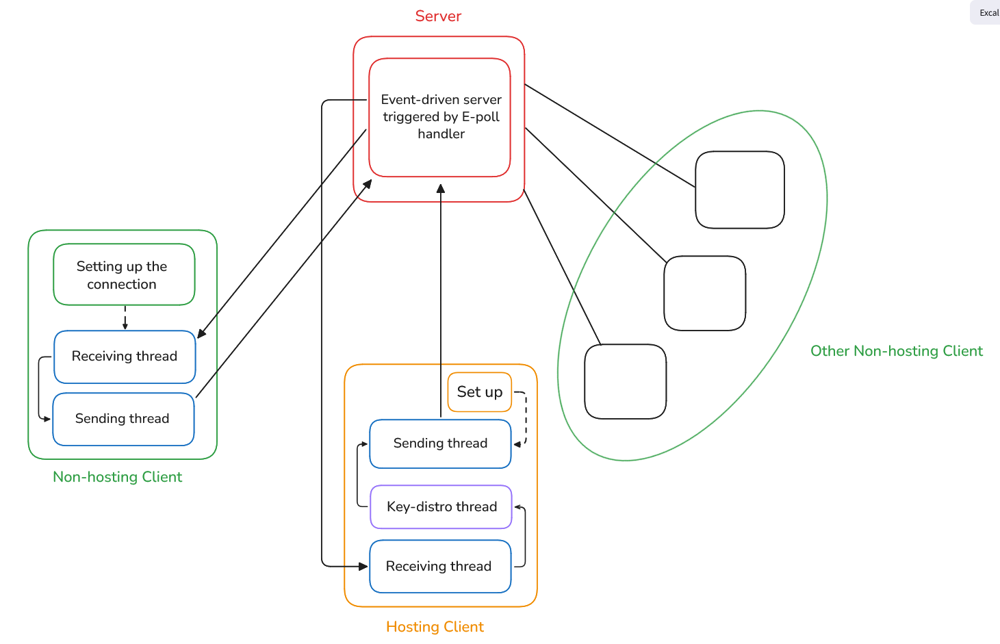

# E2EE TCP IPv6 Group Chat — C / POSIX / OpenSSL

> A high-performance, End-to-End Encrypted group chat application built from scratch in C, using raw POSIX sockets, `epoll`, `pthreads`, and OpenSSL — with a custom binary TLV protocol over IPv6 TCP.

---

## Table of Contents

- [Updates](#-update)
- [Objective](#-objective)
- [Tech Stack](#-tech-stack)
- [Getting Started](#-getting-started)
- [Approach & Design](#-approach--design)
- [Implementation Details](#-implementation-details)
- [Pros, Cons & Future Improvements](#-pros-cons--future-improvements)
- [Benchmarking](#-benchmarking)

---

## Update (v1.1)

*Working on a major update for the server, upgrading from single core E-poll handling to a hybrid Epoll triggering a bounded dynamic set of threadpool for minimizing context-switch and maximizing multi-cores throughput.*

---

## Objective

Build a **group chat system** where:
- Multiple clients can create or join named rooms over **IPv6 TCP**
- All chat messages are **end-to-end encrypted** — the server never sees plaintext
- The system is resilient to **fd-recycling (ABA)** bugs and handles **partial TCP reads** correctly via a strict binary framing protocol
- The entire stack — networking, concurrency, and cryptography — is implemented using **low-level POSIX and OpenSSL APIs**, with no high-level frameworks

---

## Tech Stack

| Layer | Technology |
|---|---|
| **Language** | C (POSIX APIs) |
| **Networking** | IPv6, Non-blocking sockets (`O_NONBLOCK`) |
| **I/O Multiplexing** | `epoll` (Level-Triggered) |
| **Concurrency** | `pthreads` (Producer-Consumer model) |
| **Cryptography** | OpenSSL — `EVP_*` APIs, Memory BIOs |
| **Symmetric Encryption** | AES-256-CBC, fresh 16-byte IV per message |
| **Asymmetric Encryption** | RSA-2048-OAEP (ephemeral keypairs, in-RAM only) |
| **Build System** | CMake |
| **Dev Environment** | WSL 2 (Ubuntu), VS Code |

---

## Getting Started

### Prerequisites

```bash
sudo apt update
sudo apt install build-essential cmake libssl-dev
```

### Build

```bash
git clone <git@github.com:codernhi123/Incognitalk.git>
cd <incognitication> # Don't worry about the mis-matched name
cmake -S . -B build
cmake --build build
cd build
# Then run the compiled files below
```

### Run

**Terminal 1 — Start the server:**
```bash
./server <port> <MAX_CLIENTS> 
```

**Terminal 2 — Start a host client (creates a room):**
```bash
./client <IP> <PORT> <Hoster_Boolean> <GroupID> <log_path>
# Hoster_Boolean = 1
# GroupID = [Random integer] since we don't care for hoster's groupID
```

**Terminal 3 — Start a joining client:**
```bash
./client <IP> <PORT> <Hoster_Boolean> <GroupID> <log_path>
# Hoster_Boolean = 0
# GroupID = [ID given to the Hoster]
```

**In-band commands:**
| Command | Description |
|---|---|
| `/exit` | Gracefully disconnect |

---

## Approach & Design

### 1. High-Level Architecture



The system has two binaries: `server` and `client`. The server is a **single-threaded `epoll` event loop** that routes encrypted frames between clients — it never decrypts anything. Each client runs a **two-thread Producer-Consumer model**: one thread drives the `epoll` network loop, the other reads stdin and sends messages.

---

### 2. Client State Machine

Each client follows a strict 4-state handshake before it can chat:

```
STATE_JUST_CONNECTED
        │
        ▼  (sends TYPE 4 or TYPE 0)
STATE_WAITING_FOR_KEY
        │
        ▼  (receives TYPE 2 key exchange)
STATE_IN_ROOM
        │
        ▼  (/exit → TYPE 3)
STATE_DISCONNECTED
```

---

### 3. Cryptographic Handshake

The system uses a **Hybrid E2EE model**:

1. On startup, every client generates an **ephemeral RSA-2048 keypair entirely in RAM** (via OpenSSL Memory BIOs — keys are never written to disk)
2. A joining client sends its **public key** to the server alongside its `TYPE 0` Join frame
3. The server forwards the public key to the **Room Host**
4. The Host encrypts the **shared AES-256 symmetric key** with the newcomer's RSA public key (OAEP padding) and signs the bundle
5. The server forwards the `TYPE 2` Key Exchange frame to the newcomer
6. From this point, all `TYPE 1` Chat frames carry: `<Sender ID> | <16-byte IV> | <AES-256 Ciphertext>`

Because keypairs are ephemeral, there is **no persistent identity** — each session is cryptographically isolated.

---

### 4. TLV Binary Protocol (Details in 'TLVBinaryProtocal.md')

Every TCP transmission uses a fixed **Type-Length-Value** binary frame. There are no newline delimiters — this correctly handles TCP's stream-oriented nature and partial reads.

```
┌──────────┬──────────────────────┬─────────────────────────────┐
│  Type    │  Payload Length      │  Payload                    │
│  1 byte  │  2 bytes (Big-Endian)│  <Length> bytes             │
└──────────┴──────────────────────┴─────────────────────────────┘
```

| Type | Name | Direction | Payload |
|---|---|---|---|
| `0` | Join | Newcomer → Server → Host | `<Group ID> <Public Key>` |
| `1` | Chat | Client ↔ Server ↔ Clients | `<Sender ID> <IV> <Ciphertext>` |
| `2` | Key Exchange | Host → Server → Newcomer | `<Target ID> <Host Pubkey> <Encrypted SymKey> <Signature>` |
| `3` | Leave | Client → Server | *(graceful disconnect)* |
| `4` | Host Init | Host → Server | Server responds with `<Group ID>` |

---

## Implementation Details

### Server: `epoll` + ABA-Safe Client IDs

- The server runs a **single-threaded Level-Triggered `epoll` loop** — no thread-per-client, no locks on the hot path
- To avoid the classic **fd-recycling (ABA) bug** (where a closed fd is reused and stale pointers misdirect events), each client is assigned a unique `uint16_t client_id` on connect
- Client and Group metadata are stored in **heap-allocated structs**; the `Client_Metadata*` pointer is stored directly in `epoll_event.data.ptr` for **O(1) dispatch** — no hash map lookup on every event

### Client: Producer-Consumer Threading

- **Main thread:** `epoll` loop — handles all network reads and state transitions
- **Secondary thread:** Blocks on `fgets` (stdin), parses commands, encrypts, and sends frames
- **Graceful shutdown:** `/exit` is intercepted **before encryption** as a local in-band command, triggering a controlled `STATE_DISCONNECTED` transition and sending a `TYPE 3` Leave frame — this avoids the complexity and signal-safety pitfalls of POSIX signal handlers

### Non-blocking I/O & Partial Reads

- All sockets are set to `O_NONBLOCK`
- The TLV framing ensures the receiver always knows exactly how many bytes to expect, correctly handling **partial TCP reads** that would break newline-delimited protocols

### Cryptography: Memory-Only Keypairs

- RSA keypairs are generated and stored **only in OpenSSL Memory BIOs** — they are never serialized to disk, preventing key leakage via filesystem artifacts
- AES-256-CBC uses a **fresh `RAND_bytes()` IV per message**, ensuring ciphertext non-determinism even for repeated plaintexts

---

## Pros, Cons & Future Improvements

### Pros

- **True E2EE:** The server routes encrypted blobs — it has zero access to plaintext messages
- **Correct TCP handling:** TLV framing eliminates delimiter-based parsing bugs and handles stream fragmentation properly
- **ABA-safe design:** Unique `client_id` decouples identity from the raw socket fd lifecycle
- **Minimal trusted surface:** Ephemeral keypairs mean no persistent key material to compromise
- **Efficient server:** Single-threaded `epoll` scales to many concurrent connections without thread-per-client overhead

### Cons

- **No persistent identity / authentication:** Because keypairs are ephemeral, there is no way to verify a returning user is who they claim to be — a malicious server could perform a MITM during the key exchange.
- **Host has to stay until the end:** For simplicity, my project assumes that Hosting client has to stay in the room until everyone left, this could be fixed by changing Hoster dynamically. 
- **Host has to endure higher load for larger scale:** Hosting client is responsible for secret key distribution, hence as it scales, hardware of hoster has more task to do.

### What Could Be Improved

*High Architecture Level:*

- **Authenticated Key Exchange:** Replace the bare RSA key distribution with a proper **Station-to-Station (STS)** or **Signal-style X3DH** protocol to prevent MITM during handshake
- **Forward Secrecy per message:** Replace the static per-room AES key with a **Double Ratchet**-style key derivation so compromising one message key doesn't expose past messages
- **Distribute the load for Hoster**: Instead of having 1 Hoster, anyone could be doing key distribution and will be decided by the server to lower the load from the current unique Hoster.

*Lower Level, more into details:*

- **Host re-keying:** Implement a host-migration protocol so the server can designate a new host if the original disconnects, re-distributing the symmetric key
- **Message sequence numbers:** Add a `uint32_t seq` field to `TYPE 1` frames to detect replay attacks and out-of-order delivery

---

## Benchmarking

> **Coming Soon**

Planned stress tests to validate the server's `epoll`-based architecture under load (Update v1.1):

- **100,000 connections** — verify the server holds concurrent connections without fd exhaustion or memory leaks
- **200,000 messages/sec throughput** — measure end-to-end message relay rate under sustained load, including AES encryption/decryption overhead on the client side

Results and methodology will be documented here once testing is complete.

---


<p align="center">
  Built with C, POSIX, and OpenSSL &nbsp;·&nbsp; Developed on WSL 2 (Ubuntu) &nbsp;·&nbsp; Done it with Love and Passion
</p>
